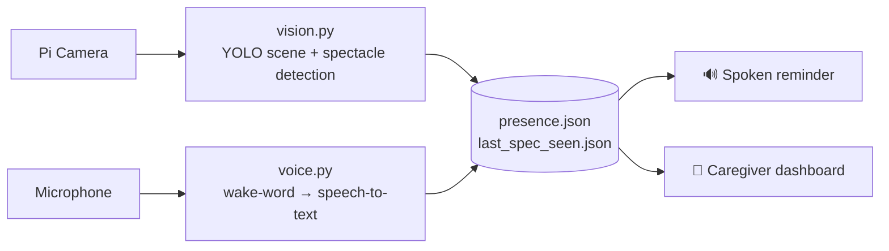

# Cognia — Scene Integration (On-Device Unit)

**Cognia** is an AI memory companion for mild dementia care. This repo is the
part that runs headless on the **Raspberry Pi**: it watches the scene, listens
for the wake-word, and speaks reminders — while writing state for the caregiver
dashboard.

> Dashboard (separate project): https://cogniaaim.netlify.app/

## Flow



`main.py` runs **two loops at once**, sharing only the flags in `state.py`:

- **Voice loop** (`voice.py`) — wait for "Hey Pico" → transcribe command → speak / set a flag.
- **Vision loop** (`vision.py`) — read frame → detect scene + spectacles → save state → announce when asked.

## What it does (user scenarios)

| Scenario | Flow |
|---|---|
| **Misplaced spectacles** *(fully implemented)* | camera tracks glasses → saves last-seen place + time → ask *"where are my glasses?"* → speaks the answer |
| **Boiling water** | camera detects kitchen scene → sets reminder → spoken + caregiver alert |
| **Daily conversation** | speech-to-text → catches *"remind me in 10 min"* → spoken reminder + task update |

## Layout

```
main.py            # entry point: starts the voice thread + vision loop
src/
├── config.py      # settings (env-overridable)
├── state.py       # shared flags between the two loops
├── voice.py       # wake-word (Porcupine) → STT (AssemblyAI) → TTS (gTTS)
└── vision.py      # YOLO detection → JSON persistence → camera loop
```

## Run

```bash
pip install -r requirements.txt
cp .env.example .env      # then fill in your API keys + model paths
python main.py
```

Needs: two YOLO `.pt` models (scene + spectacles), a `.ppn` wake-word file, a
camera + mic, and AssemblyAI + Picovoice API keys. Settings are read from `.env`
(or environment variables) via `src/config.py` — see `.env.example`.

Say **"Hey Pico"**, then a command:

| Say | Effect |
|---|---|
| "where are my glasses" | speaks last-seen place + time |
| "remind me in N minutes" | sets a countdown reminder |
| "where am i" | speaks last known location |

Stop with `Ctrl+C`.

Model / wake-word files go in `models/` (see `models/README.md`) — they are
git-ignored, so each user supplies their own.

## Notes

- Presence location is hardcoded for the demo (`kitchen_now = False` in `vision.py`) — wire it to a real scene label to enable automatic safety reminders.
- `on_turn` references `call_voiceflow` / `translator`, which aren't implemented here (from the original code); those paths raise if reached.

## License

MIT — see [LICENSE](LICENSE).
